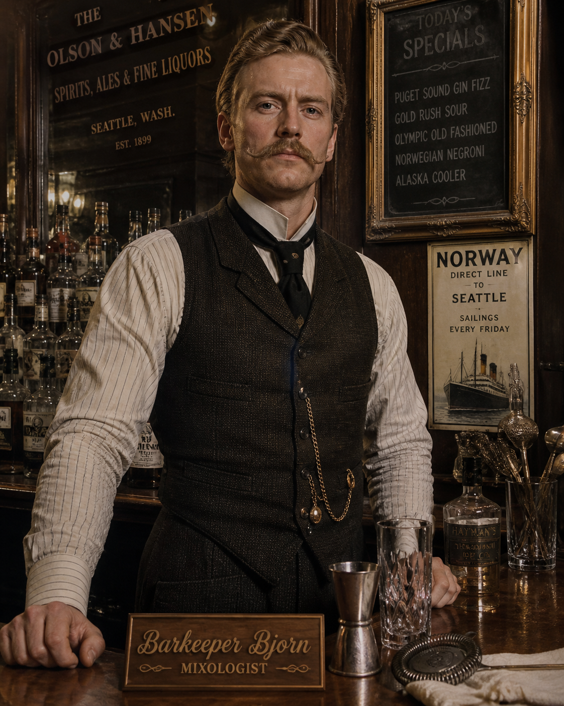

# Barkeeper Bjorn

Your friendly neighborhood bartender assistant AI agent



> *A configurable, model-agnostic AI bartender, mixologist, cocktail librarian, and gap analyst — designed to grow with you over time.*

Barkeeper Bjorn is a set of markdown configuration files that turn any modern LLM (Claude, ChatGPT, Gemini, Grok, etc.) into a personalized home-bar assistant. The agent can:

- Recommend cocktails you can build **right now** from your current inventory
- Design **original cocktails** to your taste, with full structural rationale
- Catalog your originals as `[cocktail1]`, `[cocktail2]`, etc., with proper creator attribution
- Tell you the **highest-impact next bottle** to buy based on what you already own
- Adapt to your palate over time through periodic profile re-evaluation
- Onboard new users with a **Minimalist track** (5-bottle starter kit) or a **Full track** (serious home bar)

---

## Web UI

A single-page web app for managing your bar profile, inventory, recipes, and shopping list — no server required.

**Live demo:** deploy your own in two steps:

1. **Fork this repo** on GitHub
2. **Enable GitHub Pages:** repo Settings → Pages → Source: **GitHub Actions** → Save

Your app will be live at `https://<your-username>.github.io/barkeeper-bjorn-website/` within about 60 seconds of the next push to main. The workflow file is already included — nothing else to configure.

**First run:** open the URL, click **Setup**, and enter:
- A [GitHub Personal Access Token](https://github.com/settings/tokens/new?scopes=repo&description=Barkeeper+Bjorn) with `repo` scope
- Your GitHub username and the repo name (e.g. `barkeeper-bjorn-website`)
- Branch: `main`

The app reads and writes the `data/*.json` files in your own repo — your data stays in your GitHub account.

> **Netlify alternative:** connect the repo at [app.netlify.com](https://app.netlify.com) — the `netlify.toml` at the repo root handles all configuration automatically.

---

## Quick Start (AI agent — text interface)

### Option 1 — Claude Projects (recommended)

1. Clone or download this repo
2. Create a new Claude Project
3. Upload **all** `.md` files from this repo into the Project's knowledge base
4. Start a conversation by pasting the contents of `INIT_PROMPT.md`
5. Follow the onboarding flow

### Option 2 — ChatGPT Custom GPT

1. Clone or download this repo
2. Create a new Custom GPT
3. Paste the contents of `barkeeper-instructions.md` into the GPT's instructions field
4. Upload `barkeeper.md`, `bar-owner-profile.md`, `inventory.md`, `recipes.md` to the Custom GPT's knowledge
5. Start a conversation with `INIT_PROMPT.md`

### Option 3 — Other platforms (Gemini Gem, Grok, etc.)

See [INSTALL.md](INSTALL.md) for detailed per-platform instructions.

---

## File Structure

```
barkeeper-bjorn/
├── README.md                    # This file
├── INSTALL.md                   # Detailed setup per platform
├── INIT_PROMPT.md               # Literal text to start a session
├── LICENSE                      # MIT
├── barkeeper.md                 # Agent persona — name, voice, foundation model
├── barkeeper-instructions.md    # Behavioral rules and onboarding script (v2.0, modular)
├── bar-owner-profile.md         # YOUR profile — flavor axes, descriptors, history
├── inventory.md                 # YOUR bar — stocked, past, vetoes, shopping list
├── recipes.md                   # YOUR cocktails — originals, favorites, wishlist
├── session-state.md             # In-session scratchpad — ingredients used, feedback, deltas
├── to-do.md                     # Project roadmap
├── images/                      # AI-generated cocktail artwork and bartender images
├── instructions/                # Modular instruction files (for multi-file platforms)
│   ├── core.md                  # Role, mandate, file table, JSON↔MD sync
│   ├── onboarding.md            # Session detection, persona selection, full & minimalist tracks
│   ├── behavioral-rules.md      # Inventory, vetoes, attribution, originals, recipe template
│   ├── re-evaluation.md         # Periodic check-in and session-state tracking
│   ├── analytics.md             # Analytics mode — gap analysis, ROI, flavor-space mapping
│   ├── communication.md         # Voice, formatting, persona application
│   └── safety.md                # Mental health guardrails, responsible service
├── schema/                      # JSON Schema definitions for all data files
│   ├── barkeeper.schema.json
│   ├── bar-owner-profile.schema.json
│   ├── inventory.schema.json
│   └── recipes.schema.json
└── data/                        # Structured JSON derived from MD files (system of record)
    ├── barkeeper.json
    ├── bar-owner-profile.json
    ├── inventory.json
    └── recipes.json
```

**Your files** (edit these directly): `barkeeper.md`, `bar-owner-profile.md`, `inventory.md`, `recipes.md`

**Constitution file** (mostly static): `barkeeper-instructions.md` — pull updates from upstream as the project evolves. On platforms that support multiple knowledge files (Claude Projects), you may load the `instructions/` modules individually instead.

**Structured data** (`data/`): JSON files derived from the MD files. JSON is the system of record; the agent syncs changes bidirectionally. Edit the MD files — the agent reconciles.

**Schema** (`schema/`): JSON Schema definitions for validation and future API/UI use.

---

## How Onboarding Works

When you first run the agent with empty user files, it asks one branching question upfront:

> *"Are you building a serious home bar, or just looking to make a few favorite cocktails well?"*

### Minimalist track
For occasional drinkers and people who want a small, capable bar. The agent asks for your top 4 favorite cocktails, walks you through 6 flavor-preference questions, and produces a personalized **5-bottle starter kit** (2 base spirits + 2 secondary ingredients + 1 bitters) with brand recommendations, prices, and a list of drinks you can build immediately.

### Full track
For enthusiasts and experienced home bartenders. The agent walks through your existing inventory by category, catalogs your original cocktails, and operates as an ongoing collaborator — building originals, tracking favorites, and proposing prioritized purchases.

In both tracks, the agent is **conversational by default** but watches for signals of impatience. If you say *"just give me a drink"* at any point, it skips ahead and circles back to questions later.

---

## How Personalization Works

Three layers of personalization, all visible and editable:

1. **`barkeeper.md`** — Your bartender's identity. Name (default *Barkeeper Bjorn*), voice, specialty, honesty level, banter style, and which foundation model is powering it. AI-created cocktails are attributed in the format: *"Created by [Name] (Bartender AI Agent using [Model])"* — this lets people compare which models produce the best original cocktails as recipes circulate.

2. **`bar-owner-profile.md`** — Your drinker profile. Six A/B flavor axes (sweetness, acid, strength, aromatic complexity, season, risk tolerance), playful drinker-archetype descriptors ("sophisticated," "experimental," "spirit-forward," etc.), background context, and an evolution log. The agent revisits this every ~5 cocktails to refine its understanding.

3. **`inventory.md`** + **`recipes.md`** — Your physical bar and cocktail history.

---

## Periodic Re-evaluation

After every ~5 cocktails built, the agent pauses to ask how recent drinks landed — for you and for any guests you served them to — and offers to update your flavor profile. This isn't a forced ritual; the agent reads context to time it well, and you can defer or skip.

---

## Sharing Cocktails

If you create an original (or your AI-bartender does), the agent attributes it properly:

- **Your originals:** *"Created by [Your Full Name]"*
- **AI-bartender originals:** *"Created by Barkeeper Bjorn (Bartender AI Agent using Claude Opus 4.7)"*
- **Known classics:** *"Created by Sam Ross at Milk & Honey, 2005"* (when documented)

The model attribution serves a real purpose: as AI-generated cocktails proliferate, this lets the community track which foundation models produce the most successful original cocktails.

---

## Contributing

This is a portable agent template. Forks and adaptations are encouraged. If you build a meaningfully different version (different cuisine, different drinking culture, different personality), open a PR or share it — variation is the point.

If you've made an AI-generated cocktail you love and want to contribute it to a future "community cocktails" file, include the full attribution string and the original prompt that produced it.

---

## License

MIT — see [LICENSE](LICENSE). Free to fork, modify, and redistribute. Attribution appreciated but not required.
